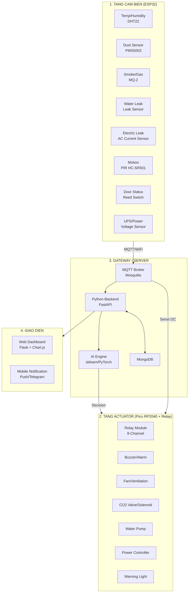

## AI-Guardian: Ke hoach Trien khai & Huong dan Di day

### Trang Thai: HOAN THANH 100% (27/03/2026) - Hardware: ESP32 NodeMCU-32S CH340 + Pico RP2040 (hoac Pico Emulator Windows)

Tat ca 9 giai doan da duoc trien khai. Xem chi tiet trong tung file nguon.

### Hardware Thuc Te

| Thanh phan | Model                    | Chip                            | USB            | Ban phim | Ghi chu |
| ---------- | ------------------------ | ------------------------------- | -------------- | -------- | -------- |
| MCU Chinh  | ESP32 NodeMCU-32S        | ESP-WROOM-32 (dual-core 240MHz) | CH340 USB-UART | 30 pins  | Cam bien |
| Actuator   | Raspberry Pi Pico RP2040 | RP2040 (dual-core 133MHz)       | Micro USB      | 40 pins  | Thu muc: hardware/pico_actuator |
| Actuator   | **Pico Emulator (Windows)** | Python + paho-mqtt            | -              | -        | Thu muc: emulator/pico_emulator |
| Server     | PC/Laptop/Server         | Python 3 + Docker               | -              | -        | Backend + MongoDB + Mosquitto |

**ESP32 NodeMCU-32S CH340 pinout thuc te:**

```
        +-------------------------------------------------------+
        |  ESP32 NodeMCU-32S (ESP-WROOM-32)    [_USB_]          |
        |                                                        |
  [EN]  |  [GND] [VIN/5V] [3V3] [IO0] [IO2]                    |
  ------+---  ---  ---  ---  ---  ---  ---  ---  ---  ---  -----
  G     |  GND  TX0  RX0  IO1  IO3  IO21  IO22  TX2  RX2  IO19 |
  N     |  ---------------------------------------------------------|
  D     |  ---------------------------------------------------------|
        |  IO34  IO35  IO32  IO33  IO25  IO26  IO27  I14  I12  GND |
        |  ---------------------------------------------------------|
  [3V3] |  IO35  IO34  IO39  IO36  IO4   IO2   IO15  IO13  GND    |
  ---   +-------------------------------------------------------+
  [GND]      INPUT ONLY    ADC1         ADC2
```

**ESP32 NodeMCU-32S GPIO Mapping (chi tiet):**

| GPIO | Chuc nang              | ADC | UART  | PWM | Ghi chu               |
| ---- | ---------------------- | --- | ----- | --- | --------------------- |
| IO0  | Boot/JTAG              | -   | -     | Yes | Nut boot, cam bien    |
| IO1  | TX0                    | -   | UART0 | Yes | Debug                 |
| IO2  | LED/Boot               | Yes | -     | Yes | Onboard LED (thuong)  |
| IO3  | RX0                    | -   | UART0 | Yes | Debug                 |
| IO4  | Cam bien / GPIO        | Yes | -     | Yes | ADC2                  |
| IO5  | GPIO                   | Yes | -     | Yes | ADC2                  |
| IO12 | GPIO (J16)             | Yes | -     | Yes | ADC2, JTAG-TDO        |
| IO13 | GPIO (J13)             | Yes | -     | Yes | ADC2, JTAG-TDI        |
| IO14 | GPIO (J14)             | Yes | -     | Yes | ADC2, JTAG-TMS        |
| IO15 | GPIO (J15)             | Yes | -     | Yes | ADC2, JTAG-TCK        |
| IO16 | GPIO / UART2 RX        | Yes | UART2 | Yes | ADC2                  |
| IO17 | GPIO / UART2 TX        | Yes | UART2 | Yes | ADC2                  |
| IO18 | GPIO / HSPI CLK        | -   | -     | Yes | SPI (VSPI)            |
| IO19 | GPIO / HSPI MISO       | -   | -     | Yes | SPI (VSPI)            |
| IO21 | GPIO / I2C SDA         | -   | -     | Yes | **I2C SDA (su dung)** |
| IO22 | GPIO / I2C SCL         | -   | -     | Yes | **I2C SCL (su dung)** |
| IO23 | GPIO / HSPI MOSI       | -   | -     | Yes | SPI (VSPI)            |
| IO25 | GPIO (DAC1)            | Yes | -     | Yes | ADC2                  |
| IO26 | GPIO (DAC2)            | Yes | -     | Yes | ADC2                  |
| IO27 | GPIO (J5)              | Yes | -     | Yes | ADC2                  |
| IO32 | GPIO (J8)              | Yes | -     | Yes | ADC1, XTAL            |
| IO33 | GPIO (J9)              | Yes | -     | Yes | ADC1, XTAL            |
| IO34 | GPIO (J7) - INPUT ONLY | Yes | -     | No  | **ADC1 (su dung)**    |
| IO35 | GPIO (J6) - INPUT ONLY | Yes | -     | No  | **ADC1 (su dung)**    |
| IO36 | GPIO (SENSOR_VN)       | Yes | -     | No  | ADC1, INPUT ONLY      |
| IO39 | GPIO (SENSOR_VP)       | Yes | -     | No  | ADC1, INPUT ONLY      |

**Luu y quan trong ve ESP32 NodeMCU-32S CH340:**

- **GPIO34, GPIO35, GPIO36, GPIO39**: Chi INPUT ONLY, khong co pull-up/pull-down
- **GPIO1 (TX0) / GPIO3 (RX0)**: UART0 cho debug/flash, nen tranh dung cho cam bien
- **IO36 (VP)** va **IO39 (VN)**: INPUT ONLY, phu hop cho analog sensors
- **CH340**: Driver USB-UART can cai dat (Windows tu dong nhan, neu co van de tai: [https://www.wch-ic.com/downloads/CH341SER_ZIP.html](https://www.wch-ic.com/downloads/CH341SER_ZIP.html))
- **Nut EN (ENable)**: Reset board
- **Nut IO0**: Nut boot (gian giut + nhan EN de vao che do flash)

**Raspberry Pi Pico RP2040 Pinout thuc te:**

```
          +------------------------------------------+
          |          RASPBERRY PI PICO               |
          |  [USB]                    [SMPS Enable] |
  [VSYS] |                                           |
  [GND]  |  GP0  GP1  GP2  GP3  GP4  GP5  GP6  GP7   |
  --------+---  ---  ---  ---  ---  ---  ---  ---+  |
  [3V3]  |  GP28 GND  GP27 GP26 GP22 GP21 GP20 GP19  |
  [3V3]  |                                           |
  [GND]  |  GP18 GND  GP17 GP16 RUN  GND  GP15 GP14  |
  --------+---  ---  ---  ---  ----  ---  ---  ---+  |
  [ADC0] |  GP26(A0)  GP22  GP21  ADC_VREF  AGND    |
  [ADC1] |  GP27(A1)  GP20  GP19  GP28(A2)          |
  [ADC2] |  GP28(A2)                              |
          +------------------------------------------+
```

**Pico RP2040 chi tiet GPIO:**

| GPIO | Analog | Chuc nang dac biet | Su dung        |
| ---- | ------ | ------------------ | -------------- |
| GP0  | -      | PWM, SPI0 TX       | Relay CH1      |
| GP1  | -      | PWM, SPI0 CSn      | Relay CH2      |
| GP2  | -      | PWM, SPI0 SCK      | Relay CH3      |
| GP3  | -      | PWM, SPI0 MOSI     | Relay CH4      |
| GP4  | -      | PWM                | Relay CH5      |
| GP5  | -      | PWM                | Relay CH6      |
| GP6  | -      | PWM                | Relay CH7      |
| GP7  | -      | PWM                | Relay CH8      |
| GP15 | -      | PWM, SPI1 MOSI     | **Buzzer PWM** |
| GP16 | -      | **I2C0 SDA**       | I2C通信 ESP32  |
| GP17 | -      | **I2C0 SCL**       | I2C通信 ESP32  |
| GP18 | -      | PWM, SPI1 SCK      | -              |
| GP19 | -      | PWM, SPI1 MISO     | -              |
| GP20 | -      | PWM, SPI1 MOSI     | -              |
| GP21 | -      | PWM, SPI1 CSn      | -              |
| GP22 | -      | PWM                | -              |
| GP25 | -      | **Onboard LED**    | Status LED     |
| GP26 | ADC0   | PWM, I2C1 SDA      | Analog in      |
| GP27 | ADC1   | PWM, I2C1 SCL      | Analog in      |
| GP28 | ADC2   | PWM                | Analog in      |
| GP27 | -      | I2C1 SCL           | -              |
| GP26 | -      | I2C1 SDA           | -              |

**Luu y quan trong ve Pico RP2040:**

- **GP25**: Onboard LED (khong can noi day, da co san)
- **I2C0 (GP16/GP17)**: Dung de giao tiep I2C voi ESP32
- **GP15**: PWM output, dung cho Buzzer
- **VSYS**: Dau vao nguon chinh (5V tu USB hoac adapter), keo nen lay tu day neu can
- **3V3**: Nguon 3.3V cho cam bien (max 300mA)
- **ADC**: Chi GP26, GP27, GP28, chi 3.3V tolerant
- **Nap code**: Gian giut nut BOOTSEL + cam USB -> khoi tao drive "RPI-RP2"

---

### Kien truc Tong the



---

### PHAN 1: HUONG DAN DI DAY CHI TIET

Xem file day du tai: `docs/wiring_diagram.md`

#### 1.1 Kiem tra Hardware cua ban

**ESP32 NodeMCU-32S CH340 - Dac diem nhan dien:**

```
Dau hieu nhan biet:
- Chip USB: CH340 (neu la CP2102 thi la version khac, van tuong thich)
- So chan: 30 pins
- Module: ESP-WROOM-32
- Nut boot: Co nut IO0 ben trai
- LED: IO2 thuong co LED xanh ben board
- Day cam: Micro USB
```

**Raspberry Pi Pico RP2040 - Dac diem nhan dien:**

```
Dau hieu nhan biet:
- Chip chinh: RP2040 (label nho tren chip)
- Bo nho: 2MB QSPI Flash
- So chan: 40 pins
- Onboard LED: GP25 (xanh duong)
- Nut BOOTSEL: Ben trai cong USB
- Cong: Micro USB
```

#### 1.2 So do ket noi ESP32 NodeMCU-32S - Cam bien

```
ESP32 NodeMCU-32S CH340 (ESP-WROOM-32, 30 pins)
=================================================================

  VIN/5V ──────────────●──────── 5V nguon (tu USB hoac adapter 5V)
  3V3   ──────────────●──────── 3.3V nguon (max 500mA)
  GND   ──────────────●──────── GND chung

  --- I2C Bus (noi voi Pico RP2040) ---
  IO21 (SDA) ─────────●──────── Pico GP16 (I2C SDA)
  IO22 (SCL) ─────────●──────── Pico GP17 (I2C SCL)
  (pull-up 4.7K keo len 3.3V)

  --- Cam bien Digital/Nhiet Do ---
  IO32 ──────────────●──────── DHT22 Data (keo pull-up 10K len 3.3V)

  --- Cam bien Analog (MQ-2) ---
  IO33 ─────────────●──────── MQ-2 A0 (qua voltage divider 10K+10K)

  --- Cam bien Digital (Leak) ---
  IO34 ────────────●──────── Leak Sensor D0 (Active LOW, pull-up 10K)

  --- Cam bien Analog (ACS712) ---
  IO35 ────────────●──────── ACS712 OUT (qua voltage divider)

  --- Cam bien Digital (PIR) ---
  IO26 ──────────────●──────── PIR HC-SR501 OUT (5V tolerant)

  --- Cam bien Digital (Cua) ---
  IO27 ──────────────●──────── Reed Switch (pull-up 10K len 3.3V)

  --- Cam bien Analog (Dien ap) ---
  IO36 ────────────●──────── Voltage Divider cho AC Input (100K+10K)

  --- Cam bien Analog (UPS) ---
  IO39 ────────────●──────── Voltage Divider cho UPS Output (20K+10K)

  --- UART (PMS5003 Dust Sensor) ---
  IO17 (TX2) ───────●──────── PMS5003 RX (UART2 - DUNG CHO CAM BIEN)
  IO16 (RX2) ───────●──────── PMS5003 TX (UART2)

  --- Status ---
  IO2 ──────────────●──────── Onboard LED (co san, chi sang LOW)

=================================================================

  LUOI CHAN (ben duoi):

  IO0   IO2  3V3
  GND   GND  VIN
  IO35  IO34  IO39  IO36  IO33  IO32  IO4   IO0
  IO2   IO4  IO15  IO13  IO12  IO14  IO27  IO26
  3V3   GND  EN
```

**Luu y quan trong khi noi day ESP32 NodeMCU-32S:**

1. **VIN**: Dau ra 5V tu USB hoac adapter, co the lay ra nuoc 5V
2. **3V3**: Dau ra 3.3V, max 500mA - chi dung cap nguon cam bien
3. **IO34, IO35, IO36, IO39**: INPUT ONLY, khong co pull-up/pull-down noi
4. **IO34/IO35**: Thuong dung cho analog sensors (ACS712, Leak)
5. **IO36/IO39**: INPUT ONLY, phu hop cho voltage sensing
6. **IO32, IO33**: Co pull-down noi, co the dung cho analog
7. **UART2 (IO16/IO17)**: Dung cho PMS5003 (tranh dung UART0 vi can cho debug/flash)
8. **I2C (IO21/IO22)**: Dung giao tiep I2C voi Pico

#### 1.3 Bang ket noi chi tiet ESP32 NodeMCU-32S

| STT | Cam bien       | Model        | Chan ESP32         | Loai    | Nguon | Ghi chu                       |
| --- | -------------- | ------------ | ------------------ | ------- | ----- | ----------------------------- |
| 1   | Nhiet do/Do am | DHT22        | IO32               | Digital | 3.3V  | 1-Wire, 10K pull-up           |
| 2   | Bu PM2.5       | PMS5003      | TX2=IO17, RX2=IO16 | UART2   | 5V    | Baud 9600, 8N1                |
| 3   | Khoi/Gas       | MQ-2         | IO33               | Analog  | 5V    | Voltage divider 10K+10K       |
| 4   | Ro nuoc        | Leak Sensor  | IO34               | Digital | 3.3V  | Active LOW, 10K pull-up       |
| 5   | Ro dien        | ACS712 30A   | IO35               | Analog  | 5V    | 1.65V offset @ 0A, divider    |
| 6   | Chuyen dong    | HC-SR501     | IO26               | Digital | 5V    | Jumper H (continuous trigger) |
| 7   | Cua mo         | Reed Switch  | IO27               | Digital | 3.3V  | Pull-up 10K, NAM=dong         |
| 8   | Dien ap AC     | Voltage Div. | IO36 (INPUT)       | Analog  | -     | 100K+10K divider              |
| 9   | Dien ap UPS    | Voltage Div. | IO39 (INPUT)       | Analog  | -     | 20K+10K divider               |
| 10  | I2C (Pico)     | -            | SDA=IO21, SCL=IO22 | I2C     | 3.3V  | Pull-up 4.7K, giao tiep Pico  |
| 11  | Onboard LED    | -            | IO2                | Digital | 3.3V  | Co san, sang khi LOW          |

**Dien tro ke (Voltage Divider) cho MQ-2 và ACS712:**

```
         5V
          |
         [10K]
          |
    ┌────-+─────┐
    │           │
  ESP32      [10K]
  IO33/IO35    │
    │         GND
  ADC input
```

**Dien tro ke cho dien ap 220V (Qua bien tach ly 10:1):**

```
AC 220V (qua bien tach ly)
          |
        [100K, 2W]
          |
    ┌────-+─────┐
    │           │
  ESP32      [10K, 0.5W]
  IO36/IO39    │
    │         GND
  ADC input
```

#### 1.4 So do ket noi Pico RP2040 - Actuator (Relay)

```
RASPBERRY PI PICO RP2040 (40 pins)
=================================================================

  VSYS ─────────────●──────── 5V tu USB hoac adapter
  VBUS ─────────────●──────── 5V tu USB (chi khi cam USB)
  3V3  ─────────────●──────── 3.3V nguon (max 300mA)
  GND  ─────────────●──────── GND chung (nhieu chan GND)

  --- Relay 8 Kenh (Signal tu Pico) ---
  GP0  ─────────────●──────── Relay IN1 (CO2 Solenoid)
  GP1  ─────────────●──────── Relay IN2 (Water Pump)
  GP2  ─────────────●──────── Relay IN3 (Exhaust Fan)
  GP3  ─────────────●──────── Relay IN4 (Main Power Cut)
  GP4  ─────────────●──────── Relay IN5 (UPS Switch)
  GP5  ─────────────●──────── Relay IN6 (Buzzer/Alarm)
  GP6  ─────────────●──────── Relay IN7 (Warning Light)
  GP7  ─────────────●──────── Relay IN8 (Door Lock)

  --- Buzzer PWM ---
  GP15 ─────────────●──────── Buzzer (+) [PWM]
  GND  ─────────────●──────── Buzzer (-)

  --- I2C Giao tiep ESP32 ---
  GP16 ─────────────●──────── ESP32 IO21 (I2C SDA)
  GP17 ─────────────●──────── ESP32 IO22 (I2C SCL)
  (pull-up 4.7K keo len 3.3V)

  --- Onboard LED ---
  GP25 ─────────────●──────── Onboard LED (xanh duong, sang LOW)

  --- Nut BOOTSEL (nap code) ---
  BOOTSEL ──────────●──────── Gian giut + cam USB de nap code

=================================================================

  LUOI CHAN (ben duoi):

  GP0   GP1   GP2   GP3   GP4   GP5   GP6   GP7   GND   AGND
  GP28  GP27  GP26  RUN   GND   GP22  GP21  GP20  GP19  GP18
  GP28  GP27  GP26  GND    3V3   GP17  GP16  GP15  GP14  GP13

  ADC: GP26, GP27, GP28 la analog input
  I2C: GP16(SDA), GP17(SCL)
=================================================================

⚠️ LUAT AN TOAN:
1. Relay Module BAT BUOC co nguon rieng 5V/10A
2. Pico chi truyen tin hieu (GPIO -> Relay IN)
3. Tat ca GND phai noi chung (ESP32, Pico, Relay GND)
4. Buzzer: (-) noi GND, (+) noi GP15
5. I2C: GP16(SDL) -> IO21, GP17(SCL) -> IO22
```

#### 1.5 Bang kenh Relay - Pico RP2040

| Kenh | Chan Pico | Thiet bi           | Loai tai  | Cong suat | Chuc nang                |
| ---- | --------- | ------------------ | --------- | --------- | ------------------------ |
| CH1  | GP0       | CO2 Solenoid Valve | Inductive | 24V AC    | Phun CO2 du khi chay     |
| CH2  | GP1       | Water Pump         | Inductive | 220V/100W | Bom nuoc khi ngap        |
| CH3  | GP2       | Exhaust Fan        | Motor     | 220V/50W  | Tang cuong hoa khi       |
| CH4  | GP3       | Main Power Cutoff  | Resistive | Contactor | Cat nguon may chu        |
| CH5  | GP4       | UPS Switch         | Signal    | 12V       | Chuyen UPS               |
| CH6  | GP5       | Buzzer/Alarm       | Buzzer    | 12V/500mA | PWM output, co IC driver |
| CH7  | GP6       | Warning Light      | Lamp      | 220V/25W  | Den canh bao             |
| CH8  | GP7       | Door Lock          | Solenoid  | 12V/1A    | Khoa cua khi xam nhap    |

**So do noi day Relay 8 kenh chi tiet:**

```
Pico RP2040          Relay Module (8-kenh)         Thiet bi ngoai
-----------          ---------------------         --------------
GP0  (Signal) -----> IN1
GP1  (Signal) -----> IN2
GP2  (Signal) -----> IN3
GP3  (Signal) -----> IN4
GP4  (Signal) -----> IN5
GP5  (Signal) -----> IN6
GP6  (Signal) -----> IN7
GP7  (Signal) -----> IN8

5V Adapter -----> VCC (Nguon rieng cho relay coil!)
GND Adapter ----> GND chung

JD-VCC (Jumper) ----> [BO QUA/JUMP] ----> 5V Adapter rieng

COM (Moi kenh) ----> Nguon thiet bi (220V/12V)
NO  (Moi kenh) ----> Thiet bi (thong thuong dong khi relay ON)
NC  (Moi kenh) ----> Thiet bi (thong thuong ngat, dung khi can)

GND Relay ----> GND nguon + GND Pico (noi chung)
```

#### 1.6 So do nguon va UPS

```
AC 220V
   │
   ├──► [Circuit Breaker 20A] ──► [Server Rack PDU]
   │
   ├──► [UPS 12V/7Ah]
   │        │
   │        ├──► ESP32 (USB 5V/1A)         [VSYS/5V]
   │        ├──► Pico RP2040 (USB 5V/1A)  [VSYS]
   │        ├──► WiFi Router (12V/1A)
   │        ├──► Camera (12V/1A, neu co)
   │        └──► Warning Light (12V, neu dung loai 12V)
   │
   ├──► [5V/10A Adapter] ──► Relay Module JD-VCC
   │                            (TACH RIENG - khong noi vao Pico)
   │
   └──► [24V Adapter] ──► CO2 Solenoid Valves (neu co)

Chia nguon cho ESP32:
  USB 5V ──► ESP32 VIN (hoac 5V pin)
  Hoac    ──► Adapter 9V/12V ──► VIN (co onboard regulator)

Chia nguon cho Pico:
  USB 5V ──► Pico VBUS (hoac VSYS)
  Hoac    ──► Adapter 5V/2A ──► Pico VSYS

Luat an toan nguon:
  - Relay: 5V/10A adapter rieng, JD-VCC JUMPER bo qua
  - ESP32: 5V/1A la du, hoac 9V/12V vao VIN
  - Pico: 5V/2A vao VSYS
  - I2C: 3.3V pull-up (dung nguon 3.3V cua ESP32)
```

#### 1.7 So do ket noi Camera AI (ESP32-CAM) - Optional

```
ESP32-CAM (AI Thinker) - Optional, neu ban co san
   │
   ├──► OV2640 Camera Module (onboard)
   ├──► GPIO4 ──► Onboard Flash LED
   ├──► GPIO33 ──► External LED (neu can)
   │
   ├──► USB (nap code) ──► USB-TTL Adapter
   │    (GPIO0 -> GND de vao che do flash)
   │
   └──► WiFi ──► MQTT Broker ──► Backend AI

Nap code ESP32-CAM:
  ESP32-CAM          USB-TTL
  ---------          --------
  U0R (RX)    <────  TX
  U0T (TX)    ────>  RX
  GND         <────  GND
  5V          <────  5V (neu can, nhung khuyen nghi dung nguon rieng)
  GPIO0       <────  GND (nen nhan nut boot + GND)

Luu y: Sau khi nap xong, nha GPIO0 khoi GND va nhan RESET
       Neu khong co USB-TTL, co the nap qua ESP32 DevKit (IO0 -> GND)
```

---

### PHAN 2: CAU TRUC THU MUC PROJECT

```
c:\Users\nguyenhoangquan\Documents\Server_IOT\
│
├── 📁 hardware/
│   ├── 📁 esp32_sensor_node/
│   │   ├── 📄 esp32_sensor_node.ino      # Code ESP32 cam bien (434 lines)
│   │   ├── 📄 config.h                   # Cau hinh WiFi, MQTT
│   │   └── 📄 sensors.h                  # Doc tat ca cam bien
│   │
│   ├── 📁 pico_actuator/
│   │   ├── 📄 main.py                   # Code Pico RP2040 (320 lines)
│   │   ├── 📄 relay_control.py          # Dieu khien relay
│   │   └── 📄 i2c_comm.py              # Giao tiep I2C voi ESP32
│   │
│   └── 📁 esp32_camera_ai/
│       ├── 📄 esp32_cam_ai.ino          # ESP32-CAM AI detection (302 lines)
│       └── 📄 model.tflite              # TensorFlow Lite model
│
├── 📁 backend/
│   ├── 📄 app.py                        # FastAPI main (781 lines)
│   ├── 📄 mqtt_listener.py              # Lang nghe MQTT, threshold alerts
│   ├── 📄 database.py                   # MongoDB async (motor)
│   ├── 📄 requirements.txt             # Python dependencies
│   ├── 📁 models/
│   │   ├── 📄 sensor_data.py
│   │   ├── 📄 alerts.py
│   │   └── 📄 incidents.py
│   ├── 📁 ai/
│   │   ├── 📄 anomaly_detection.py     # Isolation Forest + rule-based
│   │   ├── 📄 predictive_maintenance.py # LinearRegression trend + health
│   │   ├── 📄 fire_detection.py        # Temp rate + combined risk analysis
│   │   ├── 📄 face_recognition.py      # Placeholder MTCNN/FaceNet
│   │   └── 📄 fall_detection.py        # Placeholder MediaPipe/MoveNet
│   └── 📁 api/
│       ├── 📄 sensors.py
│       ├── 📄 alerts.py
│       └── 📄 actions.py
│
├── 📁 dashboard/
│   ├── 📄 app.py                        # Flask Dashboard (162 lines)
│   ├── 📁 static/
│   │   ├── 📁 css/style.css
│   │   └── 📁 js/dashboard.js
│   └── 📁 templates/
│       └── 📄 index.html
│
├── 📁 data/
│   ├── 📄 docker-compose.yml            # MongoDB, Mosquitto, Mongo-Express
│   ├── 📄 mosquitto.conf               # MQTT broker config
│   └── 📄 init_mongo.js                # Khoi tao database, tao user
│
├── 📁 emulator/
│   └── 📁 pico_emulator/
│       ├── 📄 __init__.py               # Package init
│       ├── 📄 __main__.py               # Entry point (python -m)
│       ├── 📄 main.py                   # Main entry point
│       ├── 📄 config.py                 # MQTT config, relay map, buzzer patterns
│       ├── 📄 emulator_core.py          # Core relay state + action handlers
│       ├── 📄 mqtt_client.py            # MQTT client (paho-mqtt)
│       ├── 📄 sound_manager.py          # Buzzer sound (winsound)
│       ├── 📄 ui_console.py             # Console UI (ANSI colors)
│       └── 📄 ui_tkinter.py            # Tkinter GUI (optional)
│   ├── 📄 requirements.txt              # Dependencies (paho-mqtt, pyinstaller)
│   ├── 📄 build.bat                     # Build EXE (console mode)
│   └── 📄 build_gui.bat                 # Build EXE (GUI mode)
│
├── 📁 docs/
│   ├── 📄 wiring_diagram.md            # So do di day chi tiet (368 lines)
│   ├── 📄 hardware_setup.md            # Huong dan lap rap (276 lines)
│   └── 📄 api_docs.md                 # Tai lieu API day du (420 lines)
│
├── 📄 README.md                        # Huong dan tong hop
└── 📄 requirements.txt
```

---

### PHAN 3: HUONG DAN TRIEN KHAI

#### GIAI DOAN 1: Setup Infrastructure (Docker)

**File:** `data/docker-compose.yml`

Docker Compose cau hinh 3 services:

- **MongoDB 7**: Auth enabled (admin/ai_guardian_secure_pass_2024), healthcheck, persistent volume
- **Mosquitto 2**: MQTT broker, healthcheck, persistent data/log volumes
- **Mongo-Express**: Web UI for MongoDB (port 8081)

**Chay lenh:**

```bash
cd data
docker-compose up -d
```

#### GIAI DOAN 2: ESP32 Sensor Node

**File:** `hardware/esp32_sensor_node/esp32_sensor_node.ino`

- **Cam bien**: DHT22, PMS5003 (UART), MQ-2 (analog), Leak, PIR, Reed, ACS712, Voltage divider
- **Giao tiep**: MQTT (PubSubClient), WebSocket (AsyncTCP), AsyncWebServer, OTA update
- **Chu ky doc**: 30 giay, broadcast WebSocket: 1 giay
- **AP mode fallback**: Neu WiFi that bai, khoi tao AP "AI-Guardian-Setup" (password: 12345678)

**Cai dat Arduino IDE:**

1. Cai dat ESP32 board support (File > Preferences > Additional Board URLs)
2. Chon board: "ESP32 Dev Module"
3. Flash size: 4MB (APP) / 1.2MB (SPIFFS)
4. Cau hinh WiFi/MQTT trong config.h

#### GIAI DOAN 3: Pico RP2040 Actuator (Hardware)

**File:** `hardware/pico_actuator/main.py`

- **Relay 8 kenh**: GP0-GP7 (CO2, Pump, Fan, Power, UPS, Buzzer, Light, Door)
- **MQTT**: Username/password authentication
- **Action handlers**: fire, flood, gas_leak, electric_leak, intrusion, temp_high, clear, reset, manual
- **Alarm patterns**: emergency (5x beep), warning (3x beep), ok (1x beep)

**Cai dat hardware (Pico thuc):**

1. Copy main.py vao Pico (Thonny/Picotool)
2. Dam bao umqtt.simple da duoc cai dat tren Pico
3. Cau hinh MQTT_BROKER, MQTT_USER, MQTT_PASS

#### GIAI DOAN 3B: Pico RP2040 Emulator (Windows)

**Thu muc:** `emulator/pico_emulator/`

**Files:**

| File | Mo ta |
| ---- | ----- |
| `config.py` | Cau hinh MQTT, relay map, buzzer patterns |
| `emulator_core.py` | Core logic relay state + action handlers (port tu Pico MicroPython) |
| `mqtt_client.py` | MQTT client (paho-mqtt, thay the umqtt.simple) |
| `sound_manager.py` | Buzzer sound qua winsound (Windows native) |
| `ui_console.py` | Console UI voi ANSI colors + box drawing |
| `ui_tkinter.py` | Tkinter GUI (optional) |
| `main.py` | Entry point |

**MQTT Topics (giong Pico thuc):**

| Topic | Direction | Payload |
| ----- | --------- | ------- |
| `ai-guardian/actions` | Subscribe | `{"action": "fire", "priority": "critical", ...}` |
| `ai-guardian/actuator/status` | Publish | `{"node": "pico_emulator_win", "state": {...}, ...}` |
| `ai-guardian/actuator/ack` | Publish | `{"node": "pico_emulator_win", "action": "fire", "status": "handled"}` |

**Chay Python script:**

```bash
cd emulator
pip install -r requirements.txt
python pico_emulator/main.py --console
```

**Build Windows EXE:**

```bash
cd emulator
.\build.bat
dist\PicoEmulator.exe
```

**Command line options:**

| Option | Mo ta |
| ------ | ----- |
| `--gui` | Su dung Tkinter GUI thay vi console |
| `--broker <addr>` | MQTT broker address (mac dinh: localhost) |
| `--port <port>` | MQTT broker port (mac dinh: 1883) |
| `--no-sound` | Tat am thanh buzzer |
| `--client-id <id>` | Custom client ID |

**Console commands (when running in console mode):**

```
fire, flood, gas_leak, electric_leak, intrusion, temp_high, clear, reset
manual <device> <on|off>  - Manual control
status                       - Show status
sound on|off                 - Toggle sound
exit, quit                   - Exit
```

**Actions va thiết bi được điều khiển:**

| Action | Thiết bị bật | Priority |
|--------|--------------|----------|
| `fire` | buzzer, warning_light, co2, fan, power_cut (critical) | `critical` |
| `flood` | buzzer, pump, warning_light, power_cut (critical) | `critical` |
| `gas_leak` | buzzer, fan, warning_light, power_cut (critical) | `critical` |
| `electric_leak` | buzzer, warning_light, power_cut | `critical` |
| `intrusion` | buzzer, warning_light, door_lock | `high` |
| `temp_high` | fan, buzzer/warning_light (critical) | normal/critical |
| `clear` | Tat ca OFF | - |
| `reset` | Tat ca OFF | - |
| `manual` | Theo dict `{"device": true/false}` | - |

#### GIAI DOAN 4: Backend FastAPI + AI

**File:** `backend/app.py`

**API Endpoints:**

| Method | Endpoint                     | Description                                                                          |
| ------ | ---------------------------- | ------------------------------------------------------------------------------------ |
| POST   | /api/sensors                 | Nhan du lieu cam bien, chay AI analysis                                              |
| GET    | /api/sensors/latest          | Du lieu cam bien moi nhat                                                            |
| GET    | /api/sensors/history         | Lich su cam bien (hours, limit)                                                      |
| GET    | /api/sensors/stats           | Thong ke 24h                                                                         |
| GET    | /api/alerts                  | Danh sach canh bao                                                                   |
| POST   | /api/alerts/{id}/acknowledge | Xac nhan canh bao                                                                    |
| DELETE | /api/alerts                  | Xoa cac canh bao da xac nhan                                                         |
| POST   | /api/incidents               | Tao su kien                                                                          |
| GET    | /api/incidents               | Danh sach su kien                                                                    |
| PATCH  | /api/incidents/{id}          | Cap nhat su kien                                                                     |
| POST   | /api/actions                 | Kich hoat action (fire, flood, gas, electric, intrusion, temp, clear, reset, manual) |
| GET    | /api/ai/health               | Tinh trang linh kien (0-100%)                                                        |
| GET    | /api/ai/predictions          | Du bao loi thiet bi                                                                  |
| WS     | /ws/live                     | WebSocket realtime                                                                   |
| GET    | /dashboard                   | Web Dashboard HTML                                                                   |
| GET    | /health                      | Health check                                                                         |

**MQTT Topics:**

| Topic                       | Description                |
| --------------------------- | -------------------------- |
| ai-guardian/sensors         | Du lieu cam bien tu ESP32  |
| ai-guardian/actions         | Action commands tu backend |
| ai-guardian/status          | Status ESP32               |
| ai-guardian/camera          | Camera metadata            |
| ai-guardian/camera/alert    | Camera AI alerts           |
| ai-guardian/actuator/status | Status Pico                |
| ai-guardian/actuator/ack    | Actuator acknowledgment    |

**Chay Backend:**

```bash
cd backend
pip install -r requirements.txt
uvicorn app:app --host 0.0.0.0 --port 8000
```

**AI Modules:**

- **Anomaly Detection**: Isolation Forest (sklearn) + rule-based fallback
- **Fire Detection**: Temperature rate analysis + combined risk scoring
- **Predictive Maintenance**: Linear regression trend + component health scoring
- **Face Recognition**: Placeholder (tich hop MTCNN/FaceNet/OpenCV DNN)
- **Fall Detection**: Placeholder (tich hop MediaPipe/MoveNet)

#### GIAI DOAN 5: Dashboard Web

**File:** `dashboard/app.py`

- Flask server tren port 5000
- SSE endpoint /api/stream cho realtime updates
- REST API /api/dashboard, /api/actions, /api/alerts, /api/sensors/history
- HTML/JS/CSS voi Chart.js cho bieu do realtime

**Chay Dashboard:**

```bash
cd dashboard
python app.py
```

#### GIAI DOAN 6: ESP32-CAM AI Integration

**File:** `hardware/esp32_camera_ai/esp32_cam_ai.ino`

- Camera OV2640 (AI Thinker ESP32-CAM)
- MQTT ket noi, base64 image encoding
- Placeholder cho fire detection va face recognition
- Core 1: Camera capture, Core 2: AI inference

---

### PHAN 4: DANH SACH LINH KIEN CAN MUA

| STT | Linh kien            | So luong | Chi phi uoc tinh | Ghi chu                        |
| --- | -------------------- | -------- | ---------------- | ------------------------------ |
| 1   | **DHT11**            | 2        | ~15K             | Nhiet do, do am (2 con tro)    |
| 2   | PMS5003              | 1        | ~180K            | Bu PM2.5                       |
| 3   | MQ-2                 | 1        | ~25K             | Khoi, gas                      |
| 4   | Leak Sensor Cable    | 2m       | ~80K             | Phat hien ngap                 |
| 5   | ACS712 (30A)         | 1        | ~45K             | Dong dien ro                   |
| 6   | HC-SR501 PIR         | 2        | ~30K             | Phat hien chuyen dong          |
| 7   | Reed Switch          | 2        | ~10K             | Cua mo                         |
| 8   | Relay 8 kenh         | 1        | ~90K             | Dieu khien thiet bi            |
| 9   | ESP32-CAM            | 1        | ~120K            | Camera AI                      |
| 10  | Nguon 5V/10A         | 1        | ~80K             | Cap nguon relay                |
| 11  | Day dien, breadboard | Bo       | ~100K            |                                |
| 12  | UPS mini 12V         | 1        | ~300K            | Nguon du phong                 |
|     | **TONG CONG**        |          | **~1,090K VND**  | Chua tinh ESP32 & Pico (da co) |

---

### LUU Y QUAN TRONG

⚠️ **An toan dien:**

- Luon dung Relay de cach ly dien cao ap, KHONG noi truc tiep
- UPS phai co cong suat du cho ESP32, Pico, Router, Camera
- Day dien AC 220V phai dung day chiu nhiet, co automat bao ve

⚠️ **ESP32-CAM:**

- Can nguon 5V/2A rieng, khong dung chung
- Nhiet sinh ra cao, can tan nhiet

⚠️ **MQTT Security:**

- Da bat authentication username/password trong docker-compose
- Nen dung TLS cho production
- Password mac dinh: `ai_guardian_secure_pass_2024`

⚠️ **Pico Emulator (Windows) - Thay the Pico RP2040:**

- Emulator hoat dong giong nhu Pico thuc: subscribe MQTT, xu ly actions, publish ack/status
- Chi can Python 3 + paho-mqtt, khong can hardware
- Co 2 che do: Console UI (ANSI colors) va GUI (Tkinter)
- Build thanh EXE de chay nhanh: `cd emulator && .\build.bat`
- Tat ca actions (fire, flood, gas_leak, etc.) duoc ho tro voi buzzer sounds

---

### HUONG DAN BAT DAU

#### Cach 1: Su dung Pico RP2040 thuc (Hardware)

1. **Buoc 1**: `cd data && docker-compose up -d` (Khoi dong MongoDB + Mosquitto)
2. **Buoc 2**: `cd backend && pip install -r requirements.txt && uvicorn app:app --host 0.0.0.0 --port 8000`
3. **Buoc 3**: `cd dashboard && python app.py` (Hoac truy cap qua backend: `GET /dashboard`)
4. **Buoc 4**: Nap code cho ESP32 va Pico theo huong dan trong `docs/hardware_setup.md`
5. **Buoc 5**: Cau hinh WiFi/MQTT IP trong config.h (ESP32) va main.py (Pico)

#### Cach 2: Su dung Pico Emulator tren Windows (khong can hardware)

1. **Buoc 1**: `cd data && docker-compose up -d` (Khoi dong MongoDB + Mosquitto)
2. **Buoc 2**: `cd backend && pip install -r requirements.txt && uvicorn app:app --host 0.0.0.0 --port 8000`
3. **Buoc 3**: `cd dashboard && python app.py`
4. **Buoc 4**: Chay Pico Emulator (Console mode):

   ```bash
   cd emulator
   pip install -r requirements.txt
   python pico_emulator/main.py --console
   ```

   Hoac GUI mode:

   ```bash
   python pico_emulator/main.py --gui
   ```

5. **Buoc 5**: (Optional) Build thanh EXE:

   ```bash
   cd emulator
   .\build.bat
   dist\PicoEmulator.exe
   ```
